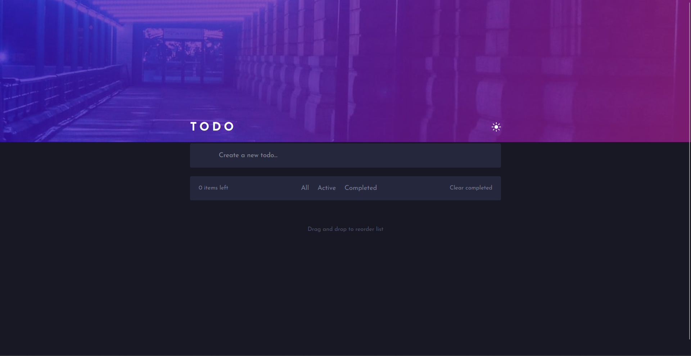
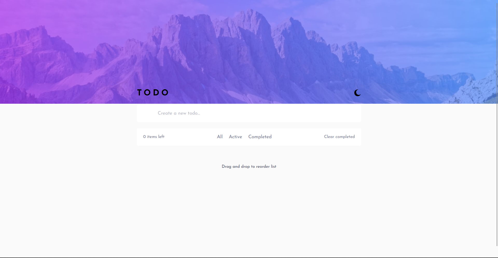

# Frontend Mentor - Todo app

This is a solution to the [Todo app challenge on Frontend Mentor](https://www.frontendmentor.io/challenges/todo-app-Su1_KokOW)

### Screenshot

### Links

- Live Site URL: [https://moselsh.github.io/Todo-List/](https://moselsh.github.io/Todo-List/)

### Built with

- Semantic HTML5 markup
- CSS custom properties
- Flexbox
- JavaScript
- React